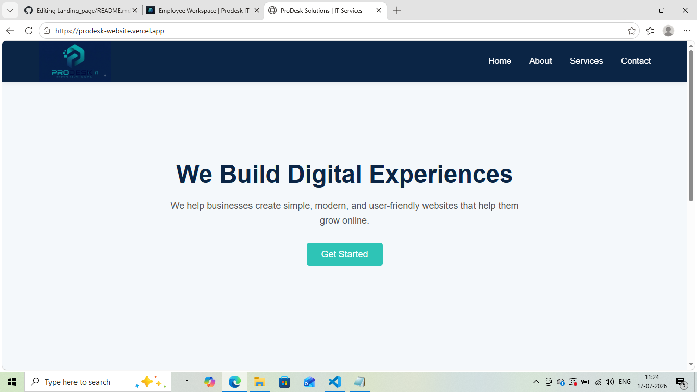
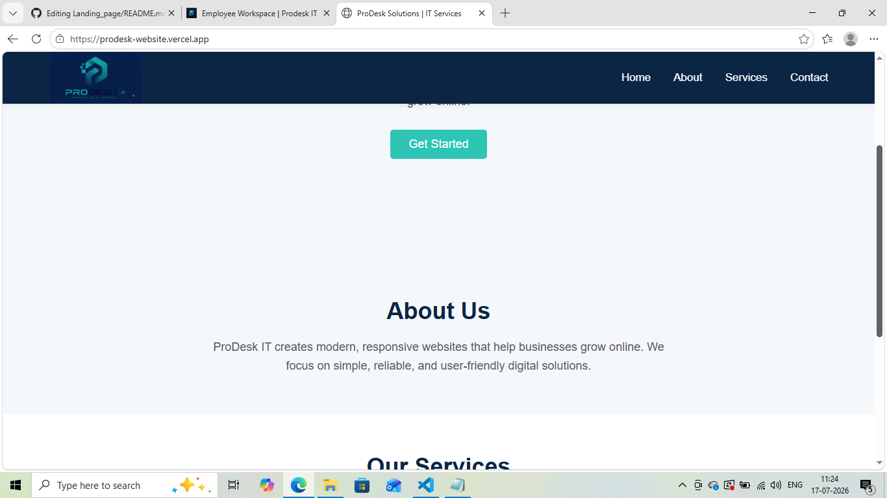
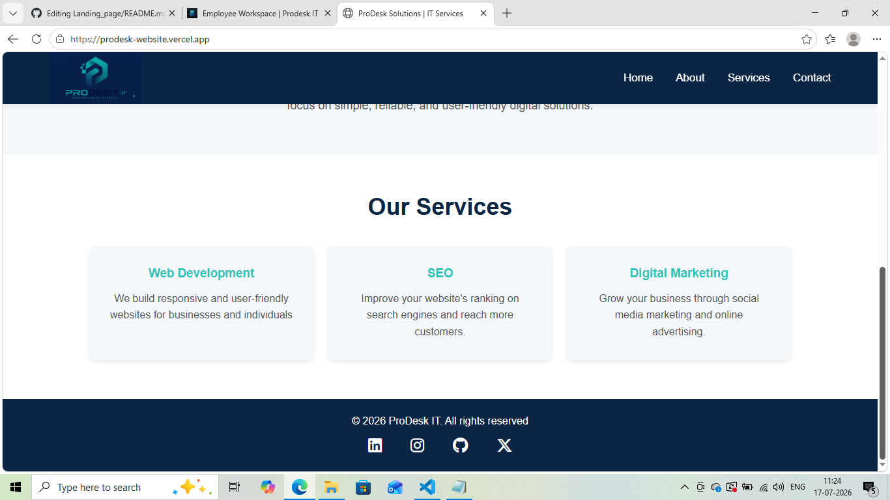

# Landing_page
# ProDesk IT
A responsive business landing page for an IT services company built using HTML, CSS, and some JavaScript.

## Features
* Responsive navigation with hamburger menu
* Hero, About, Services, and Contact sections
* High-conversion headline, sub-headline, and a primary "Get Started" CTA button.
* A CSS Grid rendering 3 service cards SEO, Web Dev and Marketing.
* Standard copyright text and Social media links in the footer
* Responsive design for desktop and mobile devices

## Technologies Used
* HTML
* CSS
* JavaScript

## Live URL
https://prodesk-website.vercel.app

## Screenshot of the deployed site

## Author

shahira sohail
